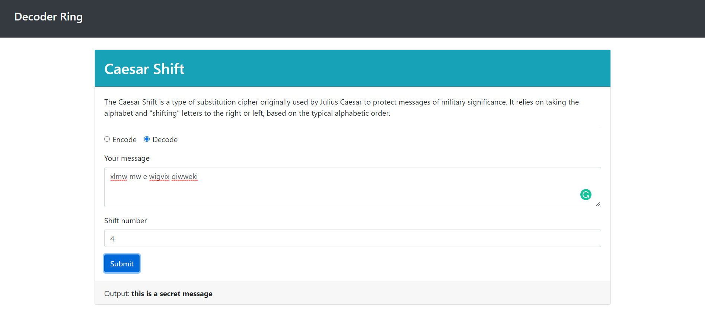
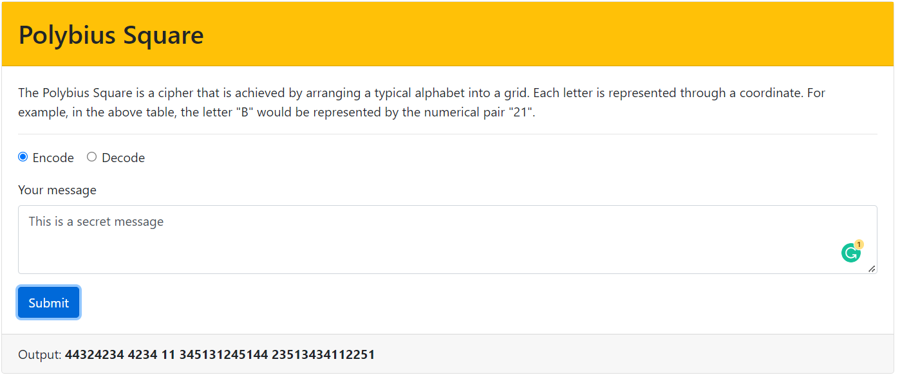
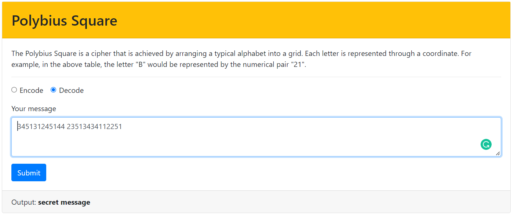
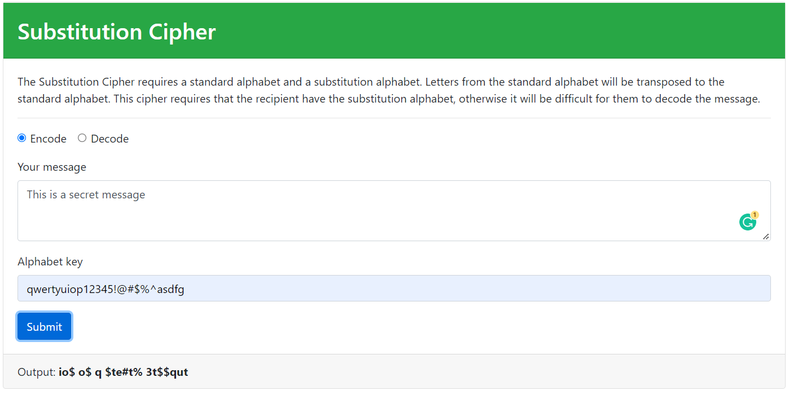
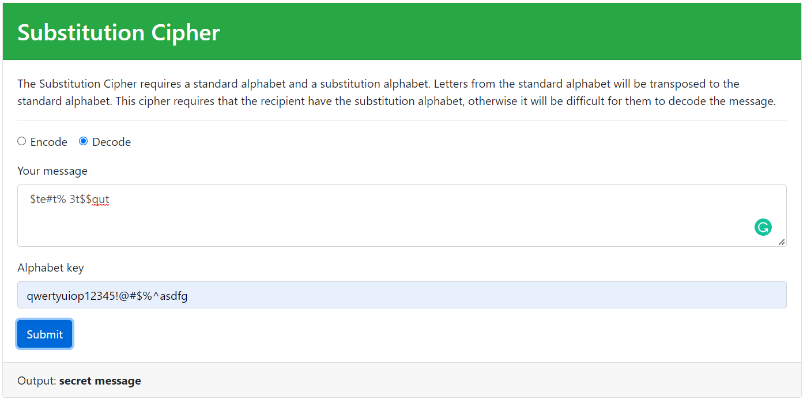

# Decoder-Ring
JavaScript for decoder application that uses different ciphers to encode and decode messages.

## Screenshots 

### Caesars Cipher

#### Encode

### Decode

### Polybius Cipher

#### Encode

#### Decode

### Substitution Cipher

#### Encode

#### Decode

